# 🍽️ Trupti - Community Food Waste Management

A web platform connecting food donors with recipients to reduce waste and feed communities. Built with Django and Bootstrap 5.

---

## ✨ Key Features

- **Dual User Roles:** Seamless experience for food donors and recipients with separate dashboards. 👥
- **Smart Search:** Find food donations by location or food type with intelligent matching. 🔍
- **Request Management:** Easy request/approval workflow for food donations. ✅
- **Real-time Updates:** Track donation status and requests in real-time. ⚡
- **Responsive Design:** Works perfectly on desktop and mobile devices. 📱💻

---

## ⚙️ Setup Guide (Windows)

### Before You Start
- **Install Python** version 3.11 or newer from [python.org](https://www.python.org/downloads/).
- During install, make sure to check **"Add Python to PATH"**.
- **Clone the repository** or download the ZIP file.

### Step 1. Open PowerShell in the Project Folder
```powershell
# Navigate to your project directory
Set-Location "C:\path\to\Community-Food-Waste-Management-System"
```

### Step 2. Create and Activate Virtual Environment
```powershell
# Create virtual environment
python -m venv .venv

# Activate it (you'll see (.venv) in the prompt)
.\.venv\Scripts\Activate
```

### Step 3. Install Dependencies
```powershell
pip install -r requirements.txt
```

### Step 4. Set Up Database
```powershell
# Apply migrations
python manage.py migrate

# Create superuser (optional)
python manage.py createsuperuser
```

### Step 5. Run the Development Server
```powershell
python manage.py runserver
```
- Visit `http://127.0.0.1:8000/` in your browser.
- Use the admin panel at `http://127.0.0.1:8000/admin/` with your superuser credentials.

### Step 6. Stop the Server
- Press **Ctrl + C** in the terminal.
- Deactivate the virtual environment when done:
  ```powershell
  deactivate
  ```

---

## 📸 Screenshots

### 🏠 Landing & Auth
| Splash Screen | Home Page | About |
|--------------|-----------|-------|
| 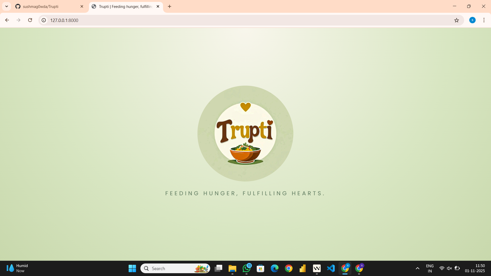 | 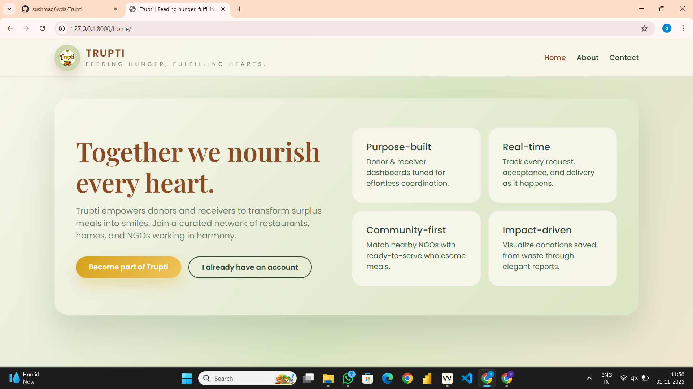 | 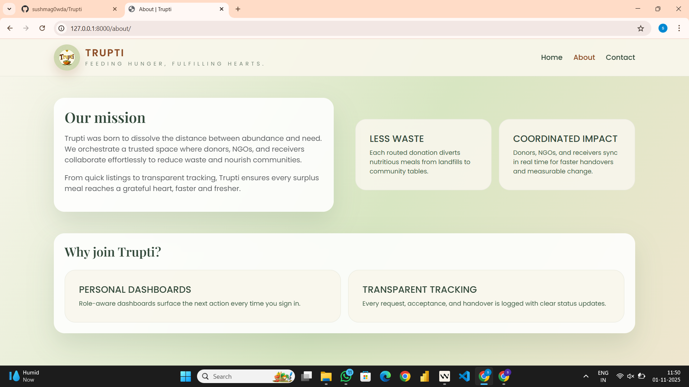 |

### 🔑 Authentication
| Register | Login |
|----------|--------|
| 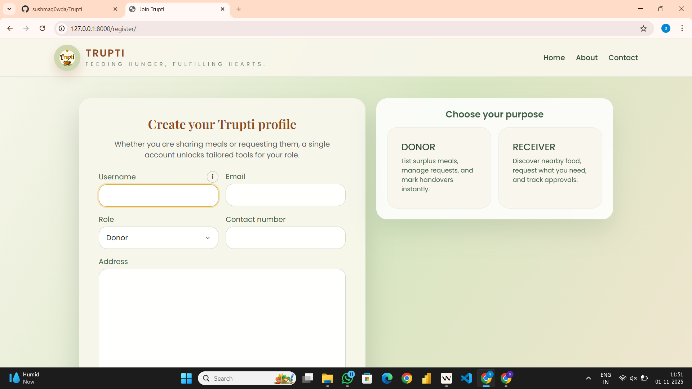 | 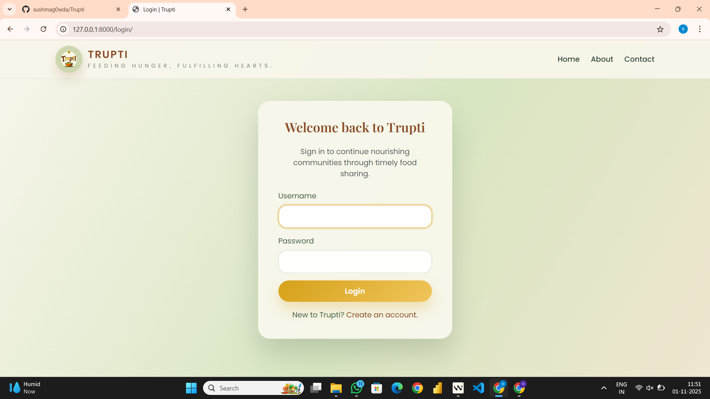 |

### 👨‍🍳 Donor Views
| Dashboard | My Donations | Create |
|-----------|--------------|---------|
| 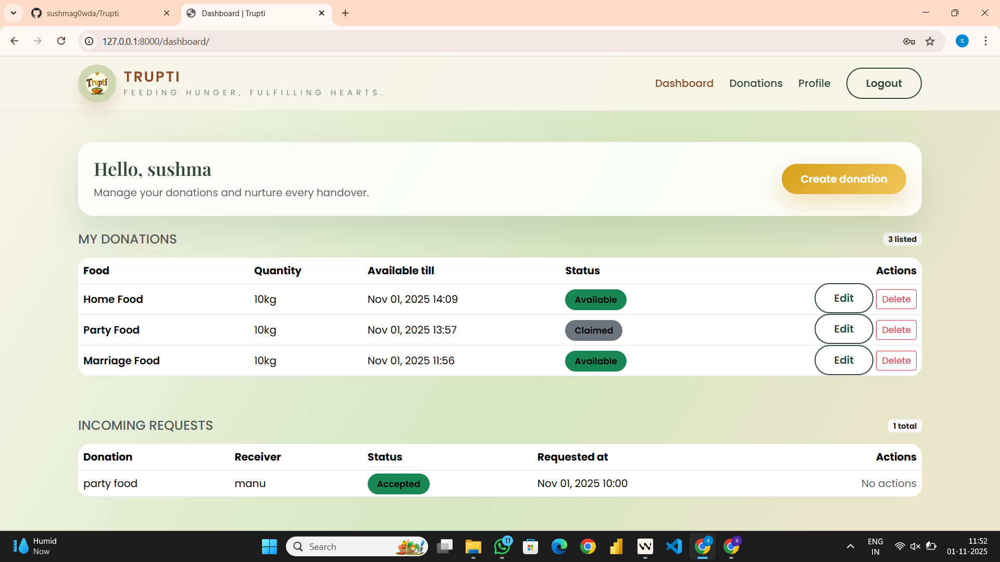 | 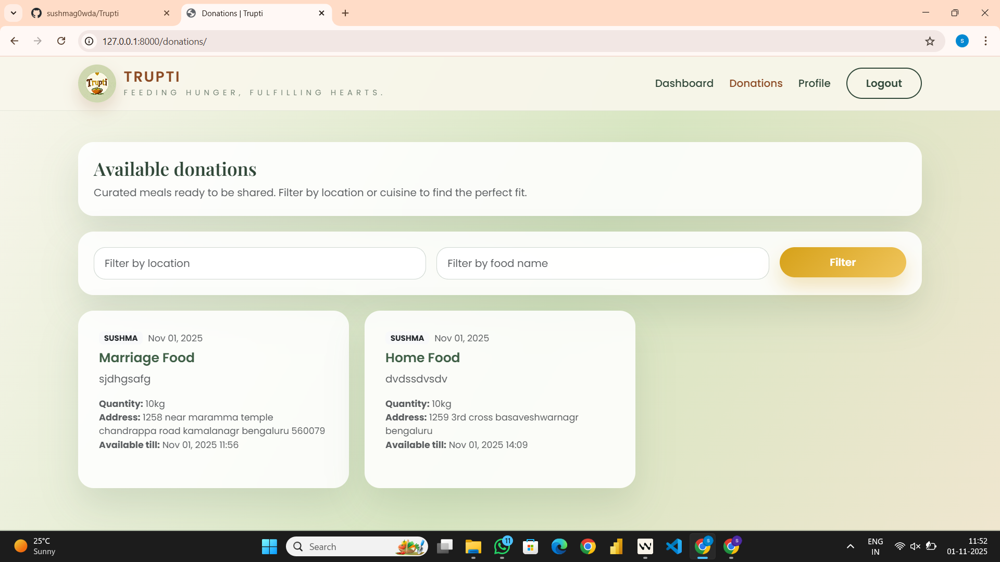 | 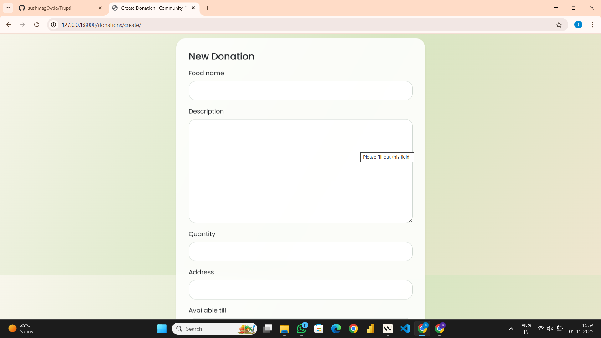 |

### 👥 Receiver Views
| Dashboard | Browse | Profile |
|-----------|---------|----------|
| 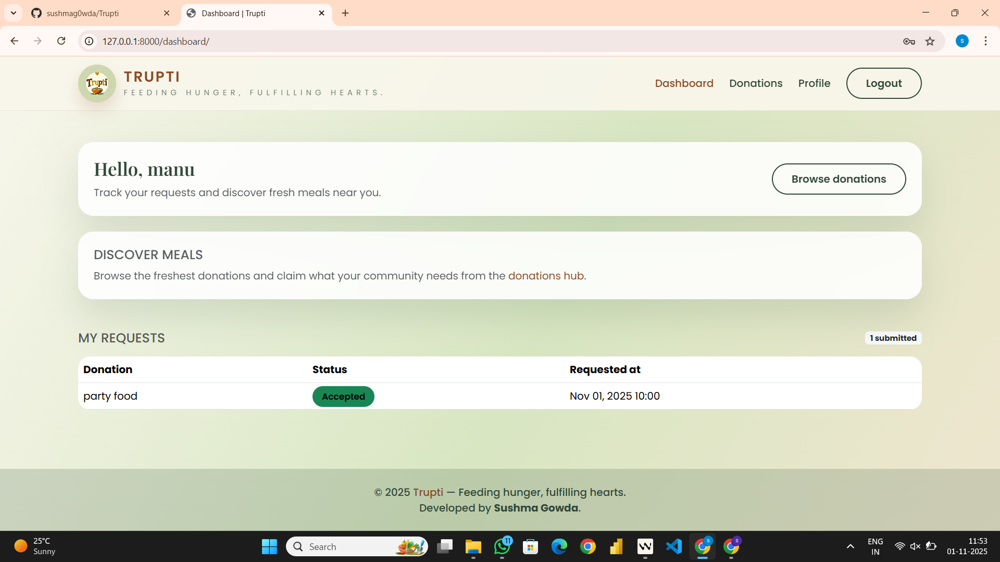 | 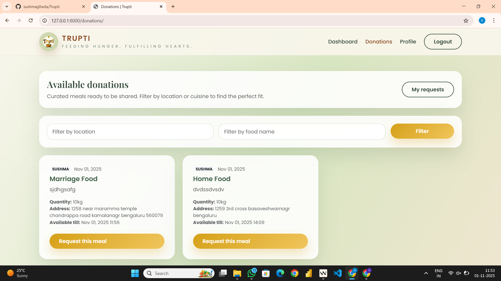 | 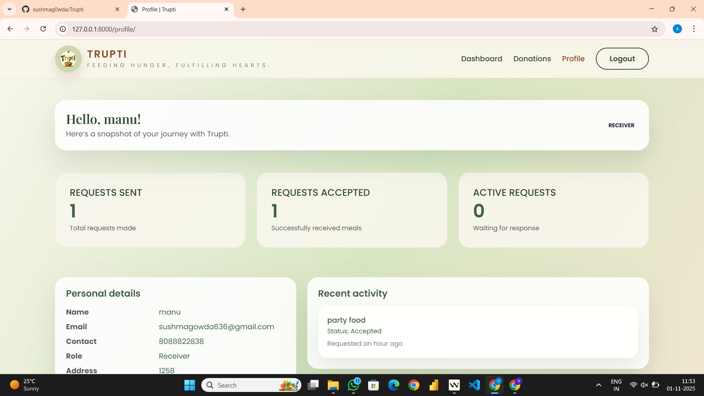 |

### ℹ️ Additional
| Contact | Donor Profile |
|---------|----------------|
| 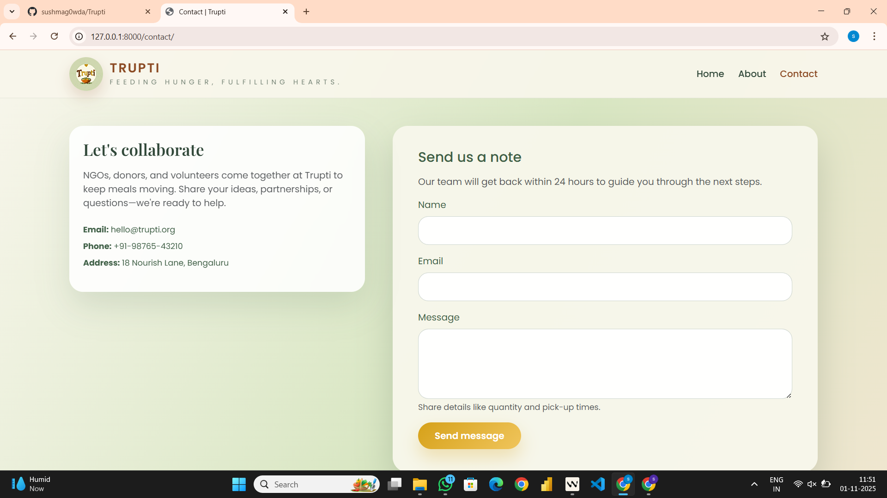 | 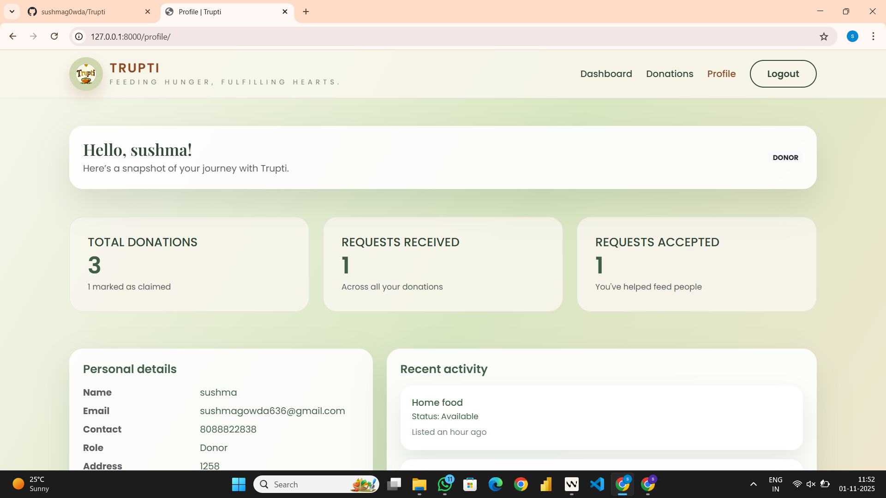 |


---

## 📝 License
This project is licensed under the MIT License - see the [LICENSE](LICENSE) file for details.

## 🙏 Acknowledgments
- Built with ❤️ using Django and Bootstrap 5
- Icons by [Bootstrap Icons](https://icons.getbootstrap.com/)
- Inspired by the mission to reduce food waste and fight hunger
python manage.py migrate
python manage.py createsuperuser  # optional for admin access
python manage.py runserver
```

Visit http://127.0.0.1:8000/ to access the site.

### Demo Data

Use the Django admin panel at http://127.0.0.1:8000/admin/ to add sample donations or requests.

## Project Structure

- `core/` – App containing models, views, forms, URLs
- `templates/` – HTML templates for pages and dashboards
- `static/` – CSS and JavaScript assets
- `food_management/` – Project settings and URL routing
- `manage.py` – Django command-line interface

## Environment Variables

Default settings are suitable for local development. Update `SECRET_KEY` and `ALLOWED_HOSTS` in production.

## Future Enhancements

- Email notifications for accepted/rejected requests
- Map integration for nearby donors
- Scheduled tasks to auto-expire donations

## License

MIT License
